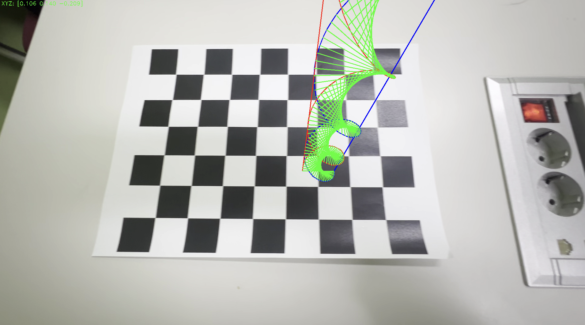
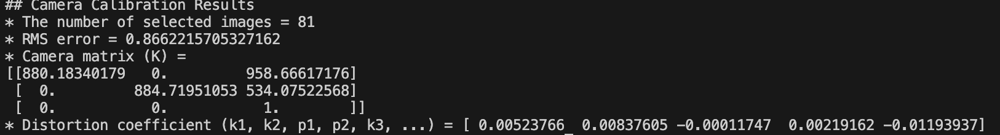

# 🧬 AR DNA on Chessboard

체스보드 패턴을 인식하여 **카메라 자세를 추정하고**,  
그 위에 3D **DNA 이중 나선(double helix)**을 증강현실로 띄우는 프로젝트입니다.

<p align="center">
  
</p>

---

## 📌 프로젝트 개요

- **체스보드 기반 pose estimation (solvePnP)**
- **OpenCV 3D → 2D 투영 (cv.projectPoints)**
- 수학적으로 계산된 **DNA 이중 나선 구조**를 가상의 도형으로 생성
- 추정된 자세(rvec, tvec)를 활용해 체스보드 위에 정확하게 배치

---

## 🔧 사용 방법

1. **체스보드 캘리브레이션** 값 준비 (`K`, `dist_coeff`)
<p align="center">
  
</p>
2. `input_file`에 체스보드가 보이는 영상 넣기
3. `board_pattern`, `board_cellsize` 설정
4. 도형 부분을 아래처럼 DNA로 교체

```python
theta = np.linspace(0, 4 * np.pi, 100)
r = board_cellsize * 1.2
z = np.linspace(0, board_cellsize * 6, 100)

helix1 = np.array([r*np.cos(theta), r*np.sin(theta), -z]).T
helix2 = np.array([-r*np.cos(theta), -r*np.sin(theta), -z]).T

center_offset = np.array([5 * board_cellsize, 3.5 * board_cellsize, 0])
helix1 += center_offset
helix2 += center_offset
```

---
## 🎥 실행 결과
영상에서 체스보드를 인식하는 순간,
중앙에 3D DNA 구조물이 떠오르며,
입체감 있게 회전된 모습처럼 보이게 렌더링됩니다.
